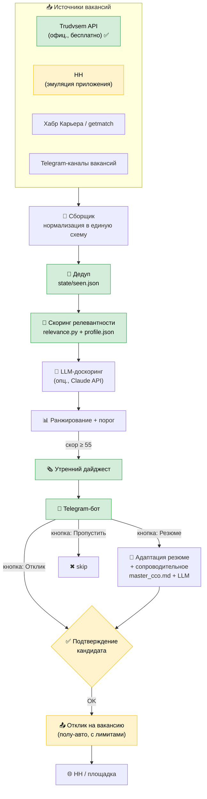
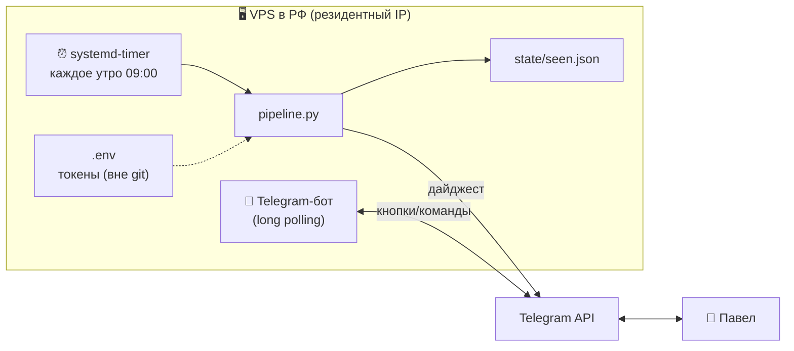

# Архитектура системы findwork

Схемы ниже рендерятся прямо на GitHub. Картинка-обзор: `docs/architecture.svg`.

## 1. Как работает система (поток данных)

🟢 зелёное — готово/легально и безопасно · 🟡 жёлтое — «серый» путь с риском бана (под подтверждением).

## 2. Что крутится на VPS (инфраструктура)

## 3. Компоненты и файлы

| Слой | Файл | Статус |
|------|------|--------|
| Профиль и веса навыков | `profile/profile.json` | ✅ |
| Эталонное резюме | `resume/master_cco.md` | ✅ |
| Скоринг релевантности | `src/relevance.py` | ✅ |
| Источники вакансий | `src/sources.py` (`sample`, `trudvsem`, `hh`) | 🚧 |
| Пайплайн дайджеста | `src/pipeline.py` | ✅ |
| Отправка в Telegram | `src/notify.py` | ✅ |
| Интерактивный бот (кнопки) | `src/bot.py` | ⏳ Фаза 2 |
| Адаптация резюме/письма | `src/tailor.py` | ⏳ Фаза 2 |
| Отклик с подтверждением | `src/apply.py` | ⏳ Фаза 2 |

## 4. Принципы

- **Human-in-the-loop:** отклик — только после подтверждения (выбранный режим). Это и
  качество, и снижение риска бана HH.
- **Легальное в приоритете:** Trudvsem API — официальный и бесплатный; HH-путь — серый,
  включается осознанно и с вежливыми лимитами/паузами.
- **Без vendor-lock:** источники за единым интерфейсом, секреты в `.env`, состояние в файле/БД.
- **Антиробот:** LLM-тексты с «шероховатостями», чтобы не выглядеть шаблонными (практика 2026).
