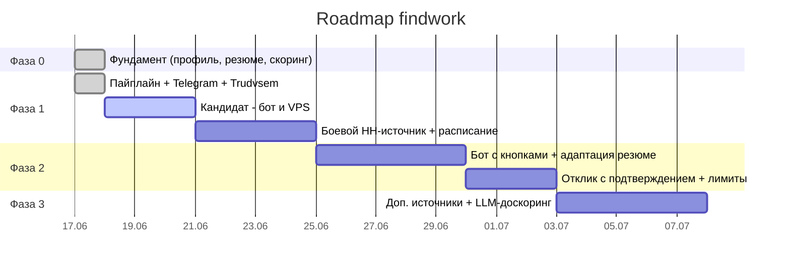

# Роадмап автоматизации findwork

Статус на сегодня: **Фаза 0 готова**, **каркас Фазы 1 готов** (пайплайн + 2 источника:
`sample` и легальный `trudvsem`; боевой `hh` — стаб под VPS).

## План работ по фазам

### Фаза 0 — Фундамент ✅ (сделано)
- [x] Структурированный профиль и веса навыков (`profile/profile.json`)
- [x] Эталонное резюме (`resume/master_cco.md`)
- [x] Скоринг релевантности (`src/relevance.py`)

### Фаза 1 — Сбор + утренний дайджест 🚧 (в работе)
- [x] Пайплайн: источник → дедуп → скоринг → дайджест (`src/pipeline.py`)
- [x] Отправка в Telegram (`src/notify.py`)
- [x] Легальный источник Trudvsem (`src/sources.py`)
- [ ] **Кандидат:** создать Telegram-бота (`docs/telegram_setup.md`) → дать токен/chat_id
- [ ] **Кандидат:** поднять VPS в РФ (`docs/vps_setup.md`)
- [ ] Боевой источник HH (эмуляция приложения на VPS, на базе `hh-applicant-tool`)
- [ ] Запуск по расписанию (systemd-timer 09:00)
- *Итог фазы:* каждое утро в Telegram приходит дайджест релевантных вакансий.

### Фаза 2 — Полу-автоотклик с подтверждением ⏳
- [ ] Интерактивный бот с кнопками (`src/bot.py`, aiogram/python-telegram-bot)
- [ ] Адаптация резюме + сопроводительное под вакансию (`src/tailor.py`, шаблон + Claude API)
- [ ] Отправка отклика по подтверждению + лимиты/паузы (`src/apply.py`)
- [ ] Лог откликов и статусов (SQLite)
- *Итог фазы:* по кнопке «Отклик» бот готовит письмо и откликается после твоего «OK».

### Фаза 3 — Расширение и качество ⏳
- [ ] Доп. источники: Хабр Карьера, getmatch, Telegram-каналы
- [ ] LLM-доскоринг описаний (тонкая семантика поверх ключевых слов)
- [ ] Дашборд статусов откликов / воронка (опц. n8n или простой веб)
- [ ] (Опц.) полный автоотклик по порогу — только по явному согласию

## Параллельный трек: резюме (можно начинать сейчас, без HH)
- [ ] Решить легенду по пересечению Pragmacore / Termoland
- [ ] Свести версии к одному эталону (возраст, метро, переезд)
- [ ] Генератор сопроводительных на базе `master_cco.md` + результата скоринга

## Визуальный план (Gantt)

## Зоны ответственности

| Кто | Что |
|-----|-----|
| **Кандидат** | создать Telegram-бота; поднять VPS в РФ; передать секреты через `.env`; решить легенду по датам; финально подтверждать отклики |
| **Разработка (я)** | весь код: источники, скоринг, пайплайн, бот, адаптация резюме, отклики; инструкции; настройка на VPS |

## Риски и митигировки

| Риск | Митигировка |
|------|-------------|
| Бан аккаунта HH (серый путь) | подтверждение откликов, лимиты/паузы, приоритет легальным источникам |
| HH меняет защиту/ломается эмуляция | источники за единым интерфейсом — переключаемся на парсер/другие площадки |
| Шаблонные AI-письма отсекают рекрутеры | «шероховатости», персонализация под вакансию, ручная вычитка топ-откликов |
| Утечка секретов | `.env` в `.gitignore`, токены только на VPS, `/revoke` при утечке |
